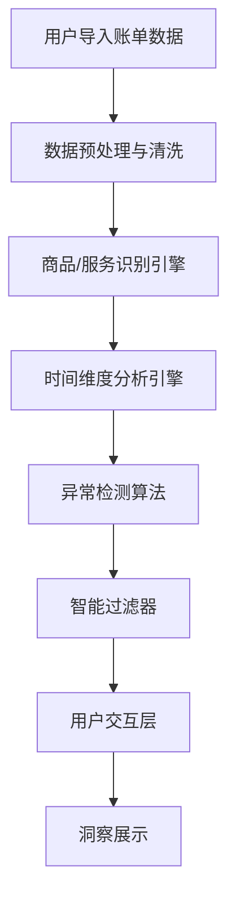
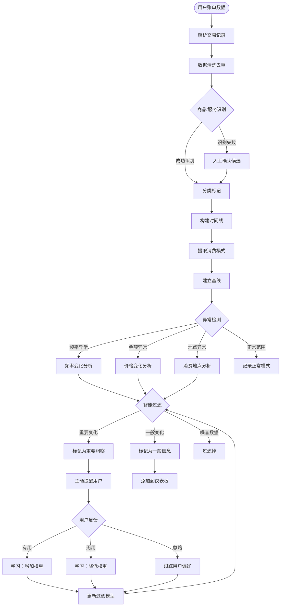
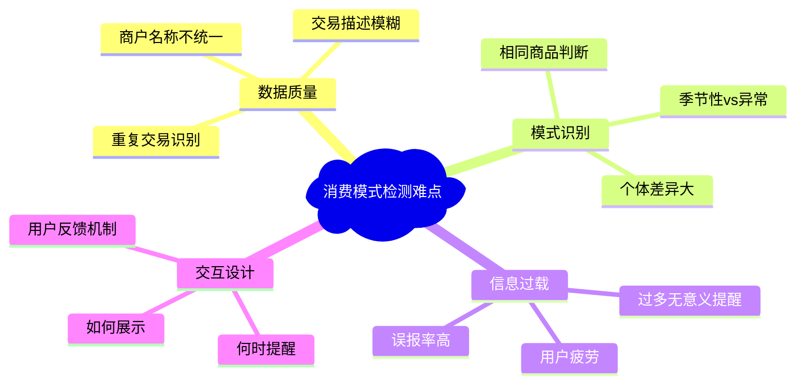
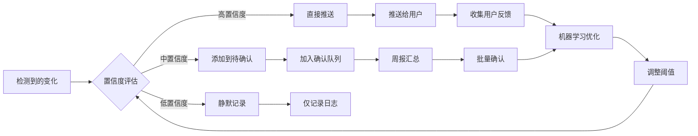
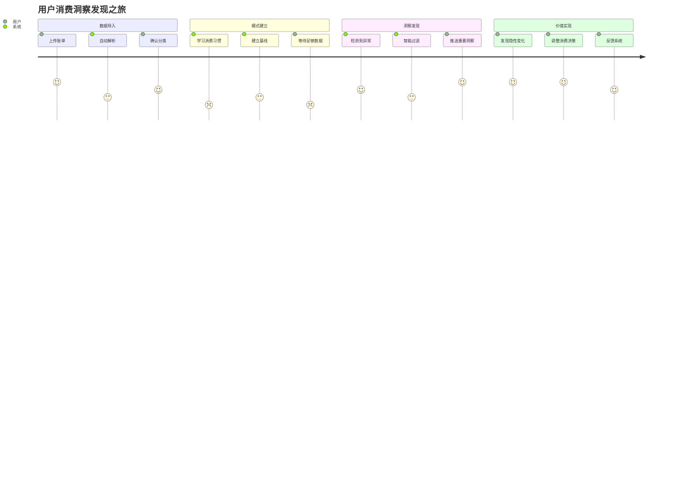

# 消费模式变化检测 - 逻辑流程图

## 整体架构流程

## 详细逻辑流程

## 核心难点与解决方案

## 智能过滤器逻辑

## 用户交互设计

## 关键设计原则

### 1. 渐进式学习
- 从少量高质量提醒开始
- 根据用户反馈逐步优化
- 避免信息过载

### 2. 置信度驱动
- 只推送高置信度的洞察
- 中等置信度的信息放入周报
- 低置信度的信息静默记录

### 3. 用户可控
- 用户可以调整提醒频率
- 可以关闭特定类型的提醒
- 可以手动标记重要商品

### 4. 上下文感知
- 考虑季节性因素
- 考虑用户生活状态变化
- 考虑外部环境影响（如疫情、节假日等）

---

**核心挑战：如何在"有用的洞察"和"信息噪音"之间找到平衡点**
